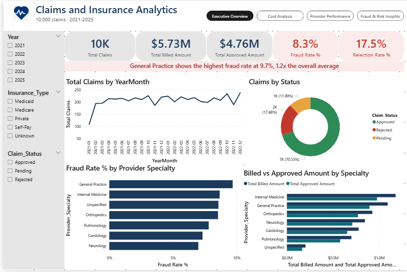
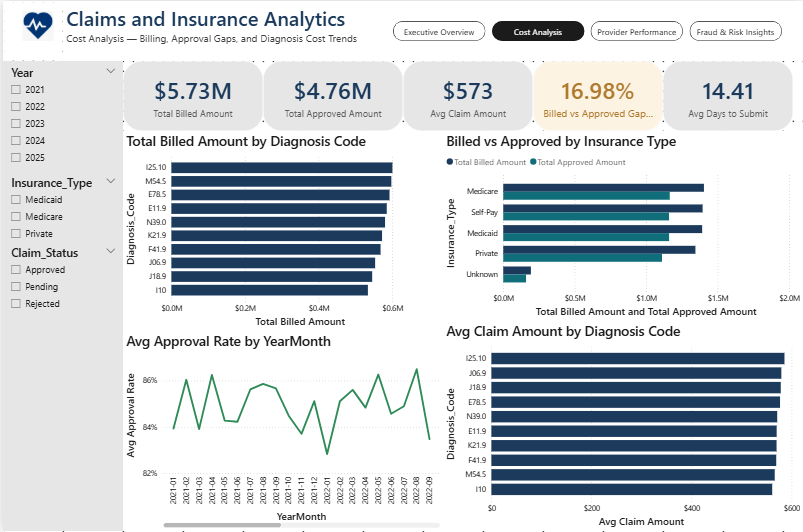
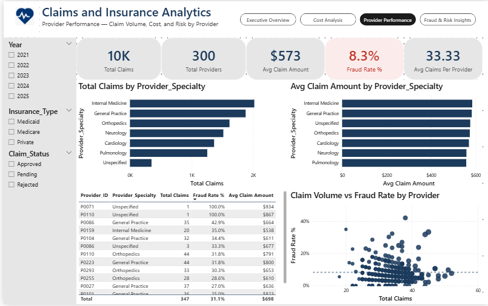
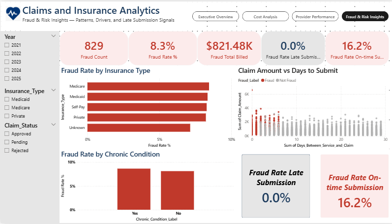

\# Healthcare Claims \& Insurance Analytics

An interactive, enterprise-style Power BI dashboard analyzing healthcare insurance claims across \*\*claim volume, billing and approval gaps, provider performance, and fraud-related patterns\*\*.

\## Project Overview

This project uses \*\*10,000 healthcare insurance claims from 2021–2025\*\* to build a four-page analytical dashboard in Power BI.

The dashboard combines data cleaning, calculated fields, DAX measures, interactive filtering, time-based analysis, provider-level analysis, and fraud-risk exploration into a single reporting experience.

\### Project Scope

\* \*\*10,000\*\* healthcare claims

\* \*\*2021–2025\*\* time period

\* \*\*300\*\* distinct providers

\* \*\*7\*\* provider specialties

\* \*\*4\*\* main insurance types + Unknown

\* \*\*8.3%\*\* overall fraud rate

\* \*\*$573\*\* average claim amount

\## Dashboard Structure

\### 1. Executive Overview

Provides a high-level view of claim volume, financial performance, and claim status.

\*\*Key metrics:\*\*

\* Total Claims

\* Total Billed Amount

\* Total Approved Amount

\* Fraud Rate

\* Rejection Rate

\*\*Visuals:\*\*

\* Claims trend by YearMonth

\* Claims by Status

\* Fraud Rate by Provider Specialty

\* Billed vs Approved Amount by Specialty

A dynamic DAX-generated insight banner identifies the specialty with the highest observed fraud rate under the currently selected filters.

\---

\### 2. Cost Analysis

Focuses on where healthcare spending is concentrated and how billed amounts compare with approved amounts.

\*\*Key metrics:\*\*

\* Total Billed Amount

\* Total Approved Amount

\* Average Claim Amount

\* Billed vs Approved Gap

\* Average Days to Submit

\*\*Visuals:\*\*

\* Total Billed Amount by Diagnosis Code

\* Billed vs Approved Amount by Insurance Type

\* Average Approval Rate by YearMonth

\* Average Claim Amount by Diagnosis Code

The diagnosis-level analysis provides both a \*\*total-cost view\*\* and a \*\*per-claim average-cost view\*\*.

\---

\### 3. Provider Performance

Analyzes claim volume, cost, and fraud-related risk across healthcare providers and specialties.

\*\*Key metrics:\*\*

\* Total Claims

\* Total Providers

\* Average Claim Amount

\* Fraud Rate

\* Average Claims per Provider

\*\*Visuals:\*\*

\* Total Claims by Provider Specialty

\* Average Claim Amount by Provider Specialty

\* Provider-level performance table

\* Claim Volume vs Fraud Rate scatter plot

The provider table combines claim volume, specialty, fraud rate, and average claim amount to support deeper provider-level analysis.

\---

\### 4. Fraud \& Risk Insights

Explores fraud-related patterns and tests a specific hypothesis around claim submission timing.

\*\*Key metrics:\*\*

\* Fraud Count

\* Fraud Rate

\* Fraud Total Billed

\* Fraud Rate for Late Submissions

\* Fraud Rate for On-time Submissions

\*\*Visuals:\*\*

\* Fraud Rate by Insurance Type

\* Claim Amount vs Days to Submit

\* Fraud Rate by Chronic Condition

\* Late vs On-time Submission Fraud Rate comparison

\### Key Finding

A specific hypothesis was tested:

> Do late-submitted claims show a higher association with fraud?

In this dataset, \*\*none of the 829 flagged fraud cases were associated with late submissions\*\*, while the observed fraud rate among on-time claims was substantially higher.

This finding is presented as a \*\*dataset-specific observation rather than a general causal conclusion\*\*.

\## Data Cleaning \& Preparation

The dataset was cleaned and prepared using Power BI/Power Query before visualization.

Key steps included:

\* Handling missing `Insurance\_Type` values using `"Unknown"`

\* Handling missing `Provider\_Specialty` values using `"Unspecified"`

\* Filling missing `Prior\_Visits\_12m` values using the median

\* Creating year, month, quarter, and YearMonth fields

\* Creating approval and fraud-related calculated fields

\* Creating chronic-condition and late-submission labels

\* Building a dedicated `DateTable` for time-based analysis

\## DAX \& Analytics

Key measures were created to support the dashboard, including:

\* Total Claims

\* Total Billed Amount

\* Total Approved Amount

\* Average Claim Amount

\* Fraud Count

\* Fraud Rate %

\* Rejection Rate %

\* Billed vs Approved Gap %

\* Total Providers

\* Average Claims per Provider

\* Fraud Rate for Late Submissions

\* Fraud Rate for On-time Submissions

A dynamic \*\*Top Fraud Specialty\*\* measure was also created to generate the Page 1 insight callout based on the currently selected filters.

\## Dashboard Design

The dashboard uses a consistent visual system across all four pages.

\### Interactivity

\* Synced slicers across all pages

\* Year filter

\* Insurance Type filter

\* Claim Status filter

\* In-report page navigation

\* Dynamic insight text

\### Visual Design

A consistent color system was used to maintain meaning across the report:

\* \*\*Navy\*\* — neutral/default values

\* \*\*Teal\*\* — secondary comparison series

\* \*\*Green\*\* — positive/approved metrics

\* \*\*Amber\*\* — caution/pending metrics

\* \*\*Red\*\* — risk-related metrics such as fraud and rejection

The design was intentionally kept consistent across pages so that color communicates meaning rather than being purely decorative.

\## Statistical Considerations

The provider-level fraud analysis includes some providers with very small claim counts. A provider with a single fraudulent claim, for example, can show a 100% observed fraud rate without providing strong evidence of consistently high risk.

This limitation was considered when interpreting provider-level results and is an important distinction between \*\*observed rates\*\* and statistically reliable risk estimates.

\## Tools \& Technologies

\* \*\*Power BI Desktop\*\*

\* \*\*Power Query\*\*

\* \*\*DAX\*\*

\* \*\*Data Cleaning\*\*

\* \*\*Data Visualization\*\*

\* \*\*Exploratory Data Analysis\*\*

\* \*\*Statistical Analysis\*\*

## Dashboard Preview

### Executive Overview

### Cost Analysis

### Provider Performance

### Fraud & Risk Insights

\## Project Objective

The objective of this project was to transform raw healthcare claims data into an interactive analytical reporting solution that demonstrates practical skills in \*\*data preparation, Power BI visualization, DAX, statistical reasoning, and business-oriented insight generation\*\*.

